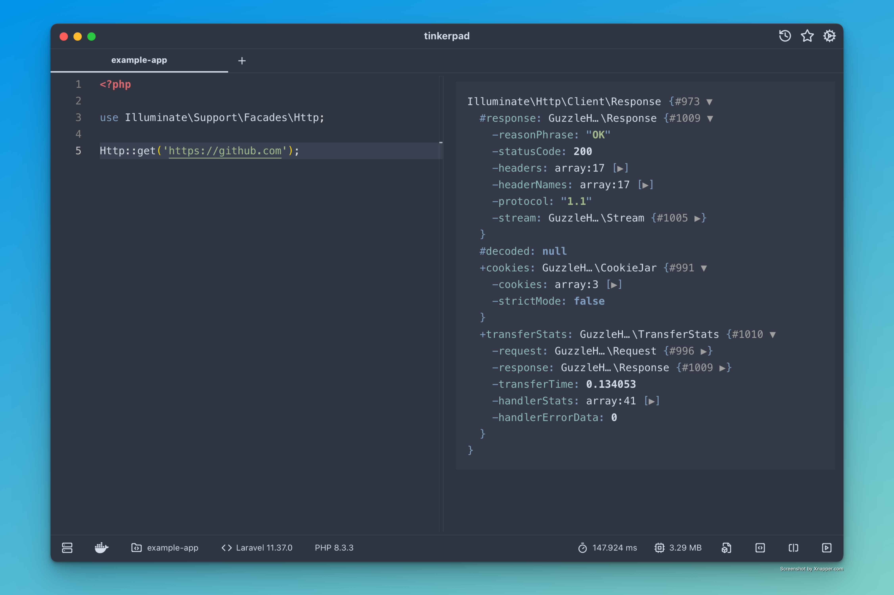

<div align="center">
<a href="https://github.com/epessine/tinkerpad/"></a>
</div>
<h1 style="margin-top: 0px;" align="center">Tinkerpad</h1>
<div align="center">

[](https://github.com/epessine/tinkerpad/blob/main/LICENSE)
[](https://github.com/epessine/tinkerpad/releases)

[](https://github.com/epessine/tinkerpad/stargazers)
[](https://github.com/epessine/tinkerpad/fork)

<strong>Tinkerpad is an open source, lightweight and blazing fast PHP playground that works with Docker and SSH.</strong>

[**See Documentation**](https://github.com/epessine/tinkerpad/wiki)
</div>

<picture>
 
</picture>

## Features

* Ultra lightweight and fast, built on Go and Webview2 (powered by [Wails](https://github.com/wailsapp/wails)).
* User-friendly and modern UI, multiple light and dark themes.
* Enjoy fast and fluid code autocomplete (powered by [Phpactor](https://github.com/phpactor/phpactor))
* View and explore structured output of your code (powered by [VarDumper](https://github.com/symfony/var-dumper))
* Benchmark your code by inspecting the run time and peak memory usage.
* Can run code via Docker containers, SSH connections and locally, all isolated by tabs.
* Works with Laravel, Wordpress, Symphony, and more.
* Save your favorite code snippets for later use!
* Up to 100 snippets history to go back if needed.


## Installation

Download the latest release for free [here](https://github.com/epessine/tinkerpad/releases).

## Troubleshooting

If you can't open the app after installation on macOS, navigate to `Privacy & Security` and click `Open Anyway` at the bottom of the page.

You can also exec the command below instead:
``` shell
 sudo xattr -d com.apple.quarantine /Applications/Tinkerpad.app
```
